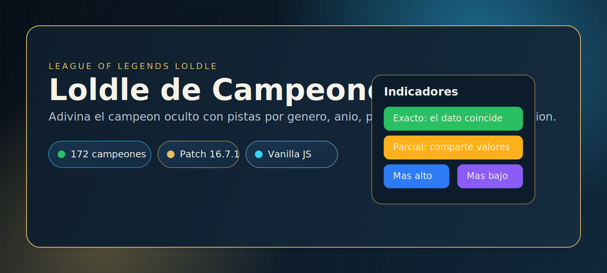
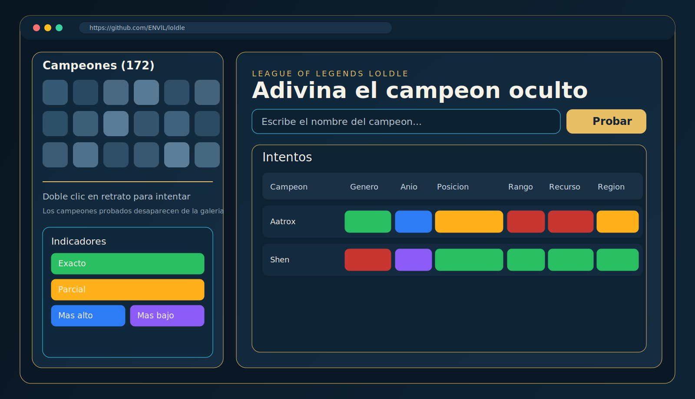
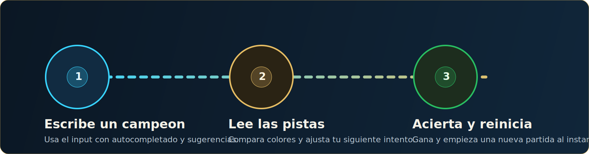

<p align="center">
  
</p>

<h1 align="center">Loldle de Campeones</h1>

<p align="center">
  Juego web estilo Loldle para adivinar el campeon oculto de <strong>League of Legends</strong> con pistas por atributos.
</p>

<p align="center">
  
  
  
  
  
</p>

## Vista rapida



## Flujo de juego



## Caracteristicas

- Lista completa de campeones con autocompletado y sugerencias en vivo.
- Galeria lateral de retratos (doble clic para intentar rapido).
- Comparador visual por categorias: genero, anio, posicion, rango, recurso y region.
- Estados de pista por color: exacto, parcial, incorrecto, mas alto y mas bajo.
- Reinicio instantaneo de partida con nuevo campeon secreto.

## Ejecutar en local

```bash
git clone https://github.com/ENVlL/loldle.git
cd loldle
python3 -m http.server 5173
```

Abre `http://localhost:5173` en el navegador.

## Estructura del proyecto

```text
.
├── index.html
├── styles.css
├── app.js
├── champions-data.js
├── champions.json
└── assets/
    └── readme/
        ├── hero.svg
        ├── preview.svg
        └── flow.svg
```

## Reglas de pista

1. `Exacto`: el dato coincide con el campeon secreto.
2. `Parcial`: comparte parte de la informacion (listas como posiciones o regiones).
3. `Mas alto / mas bajo`: indica la direccion para el anio de lanzamiento.

## Datos

- Fuente principal: Riot Data Dragon.
- `champions-data.js` incluye version del parche y metadatos de campeones.
- Imagenes de campeones servidas desde CDN oficial de Riot.

## Creditos

- Inspirado en la mecanica de Loldle.
- Datos e imagenes: Riot Games (Data Dragon).

---

Si te gusta el proyecto, dale una estrella en GitHub.
